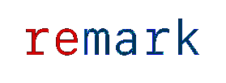
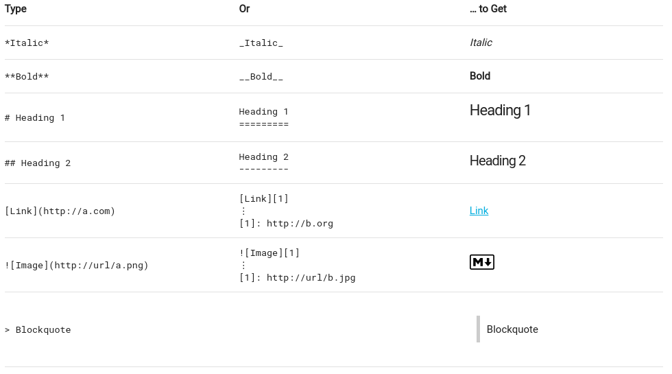
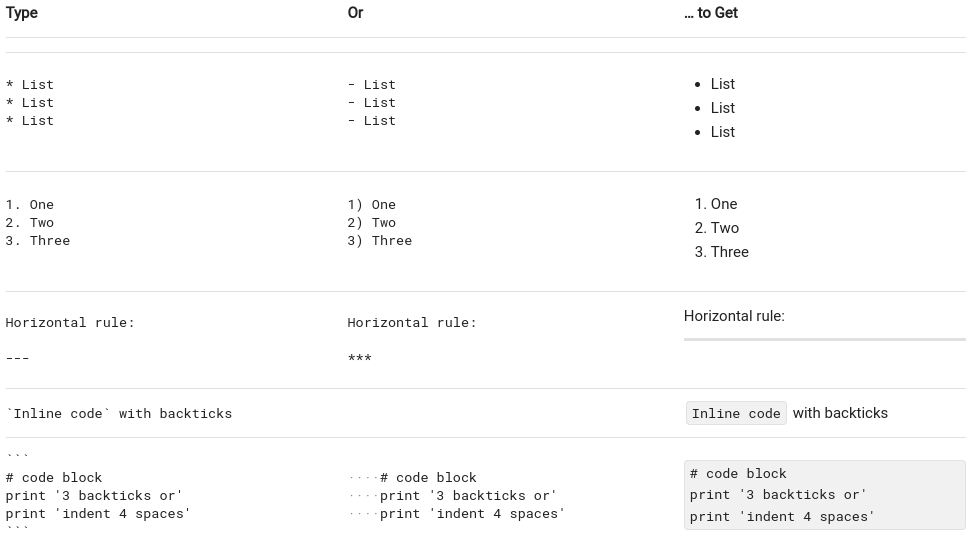
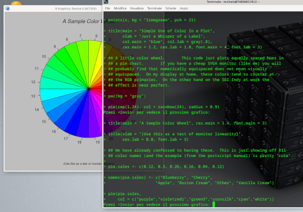
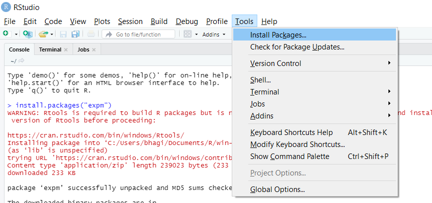

```{r load_packages, message=FALSE, warning=FALSE, include=FALSE}
## install.packages("pacman")
pacman::p_load(fontawesome, xaringan, xaringanExtra, knitr, tidyverse, emoji, leaflet)
```
class: inverse, middle, center
***
#.warmyellow[About me]

##Michele Bonsignore
Ci fu un tempo nostalgico in cui Fedora era solo un cappello e la buffa tuba di Mandrake una distro Linux che faceva lo sgambetto alla neonata RedHat.

Per fortuna oggi sono felicemente debianizzato e ne vado fiero.
***

###`r fa("mastodon", fill = "#005EB8")` [mastodon.uno](https://mastodon.uno/@michelebonsignore)&nbsp;-&nbsp; `r fa("telegram", fill = "#005EB8")` [telegram](https://t.me/Mikethepenguin) <br> `r fa("linux", fill = "#005EB8")` [OpenLinux/bibliomike](https://openlinux.it/author/bibliomike/)

---
class: inverse,middle

#.warmyellow[Acknowledgments]

.left-column[
#`r fa("linux", fill = "black")`
<br>
#`r fa("r-project", fill = "black")`
<br>
#`r fa("face-smile", fill = "black")`
]
.right-column[
Vimelug: <span class="lug">&nbsp;- &nbsp;&nbsp; Vimercate </span>L<span class="lug">inux</span> U<span class="lug">ser</span> G<span class="lug">roup &nbsp;&nbsp;-</span>
`r fa("telegram", fill = "#005EB8")` [telegram.me/vimelug](https://telegram.me/vimelug) &nbsp;&nbsp; - &nbsp;&nbsp; `r fa("firefox-browser", fill = "#005EB8")` [vimelug.org/](https://vimelug.org)

<br>
[The R Project for Statistical Computing](https://www.r-project.org)

<br>
<br>
`r fa("github", fill = "#005EB8")`[xaringan](https://github.com/yihui/xaringan) .lug[developed by Yihui Xie]

`r fa("github", fill = "#005EB8")`[xaringanExtra](https://github.com/gadenbuie/xaringanExtra) .lug[developed by Garrick Anden-Buie]
]

---
```{r xaringanExtra, echo=FALSE}
titolo <- "Presentazione ADMT";
use_webcam()
use_progress_bar(color = "#AE2573", location = "bottom")
use_clipboard()
use_broadcast()
## use_animate_all("slide_up") 'arg' should be one of
## "slide_left", "slide_right", "slide_up", "slide_down", "roll", "fade"
```

```{r xaringanExtra-styleBan, echo=FALSE}
  style_banner(
    text_color = "white",
    background_color = "#FF6601",
    padding_vertical = "8px"
  )
```

```{r use_banner, echo=FALSE}
  use_banner(
    top_left = "<div class=\"logo_left\">VIME<span class=\"lug\">LUG by ADMT</span></div>",
    top_center = c("<span class=\"banTitolo\">",titolo,"</span"),
    top_right = "<span class=\"lug\">- &nbsp;&nbsp; Vimercate </span>L<span class=\"lug\">inux</span> U<span class=\"lug\">ser</span> G<span class=\"lug\">roup &nbsp;&nbsp;-</span>",
    bottom_center = "<span class=\"noBack\">I contenuti prodotti da <a href=\"https://vimelug.org/\" target=\"_blank\">VIMELUG</a> sono integralmente rilasciati sotto licenza <a href=\"https://creativecommons.org/licenses/by-nc-sa/4.0/deed.it\"> Creative Commons v. 4.0 CC BY-NC-SA</a></span>",
    exclude = "inverse"
  )
```

# Cos'è **remark.js**
--

.pull-left[]
.pull-right[remark markdown processor powered by plugins part of the `@unifiedjs` collective]
<br clear="left">

--

***

.center[
#.black[`r fa("js", fill = "#005EB8")` Javascript]

##and

#`r fa("markdown", fill = "#005EB8")` Markdown
]

***
---

# `r fa("markdown", fill = "#005EB8")` Markdown in pillole 1/2


---
# `r fa("markdown", fill = "#005EB8")` Markdown in pillole 2/2



---
.ellipse[]
#Cos'è **xaringan**

--

`Xaringan` è un pacchetto per `r fa("r-project", fill = "black")` sviluppato da [Yihui Xie](https://yihui.org/) per produrre contenuti sfruttando le funzionalità `remark.js` ed `Rmarkdown`.

--

__R markdown__ è l'interfaccia *notebook* del linguaggio `r fa("r-project", fill = "black")`: aggiunge a Markdown funzionalità avanzate di scripting in vari linguaggi (es. R, Python, SQL)

--

__Literate Programming__: Con Xaringan potrai creare presentazioni riproducibili aggiungendovi le funzionalità di data analysis del linguaggio `r fa("r-project", fill = "black")`.

--

.center[
 `r fa("folder-plus", fill = "#005EB8")` `r fa("folder-plus", fill = "#005EB8")` 
]

---
class:inverse,middle,center
<hr>
#Installazione del software
<hr>
---
# Fase 1. Installiamo `r fa("r-project", fill = "#005EB8")`
* Seguire le guide disponibili su https://cran.r-project.org/.

A titolo di esempio riportiamo le istruzioni per l'installazione su Linux/Debian:
.pull-left[
```
sudo apt update
sudo apt install r-base r-base-dev
```
Per vedere se tutto funziona correttamente avviamo `r fa("r-project", fill = "black")` da terminale con l'istruzione `R`, e con la funzione `demo(graphics)` facciamo girare un paio di esempi grafici:
]
.pull-right[
]

---
# Fase 2. Installiamo RStudio

L'ambiente di sviluppo non è in bundle con `R` pertanto è necessario prima aver già installato l'interprete `r fa("r-project", fill = "black")`.

--

* Installiamo ora l'ambiente di sviluppo **vivamente consigliato** [rstudio-desktop](https://posit.co/download/rstudio-desktop/).

--

  * In alternativa possono andar bene anche altri IDE installabili dai repository della propria distribuzione come `Rkward` o `R Commander` ma il paragone con RStudio non regge.
  
--

  * RStudio è multipiattaforma quindi disponibile come pacchetto per Linux `.deb` o `rpm` e per windows come installler binario.

--

  * Esiste inoltre la possibilità per i diversi O.S. di avviare **Rstudio** da "Tarball", ovvero senza installarlo sul sistema.

---
# Fase 3. Pacchetti di base

Si veda il TaskView specifico del repository CRAN https://cran.r-project.org/web/views/ReproducibleResearch.html alle sezioni **HTML** e **Markdown**.

Installiamo i pacchetti necessari al nostro scopo attraverso il menu di RStudio `tools/Install Packages`.


---

# Fase 4. Pacchetti opzionali

Anche se non siamo obbligati a farlo vi consiglio di aggiungere alla vostra lista di tools anche i seguenti pacchetti, installandoli da console o da menu grafico:
```{r extrapackage, eval=FALSE}
  install.packages( c("fontawesome","emoji","leaflet") )
```

Se volessimo invece installare tutti i pacchetti in un colpo solo o caricare all'avvio i pacchetti già installati il package manager **PACMAN** ci viene in aiuto:  http://trinker.github.io/pacman/vignettes/Introduction_to_pacman.html

```{r pacman, eval=FALSE }
# install.packages("pacman")
# la funzione pacman::p_load() ci permette di caricare i pacchetti e anche
# di installarli al volo se necessario
pacman::p_load(fontawesome, xaringan, xaringanExtra, knitr, tidyverse, emoji, leaflet)
```


